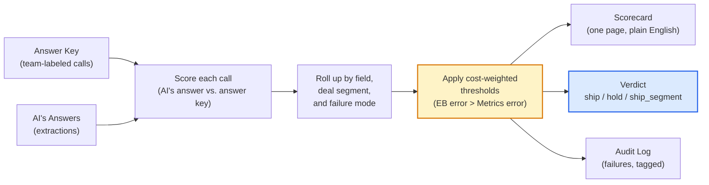

# meddpicc-eval

**A practical eval harness for deciding whether to trust — or switch — your AI model for MEDDPICC extraction.**

When an AI writes to Salesforce, the only question that matters is: *is it right often enough on the things that cost money when it's wrong?* This skill answers that in hours, not weeks — with a one-page scorecard, a machine-readable `ship` / `hold` / `ship_segment` verdict, and an audit log naming the specific failure modes hurting you most.

---

## Sample output

The shipped demo runs against a deterministic 100-call regression fixture. Below is the actual scorecard it generates — verdict, per-field deltas, segment breakdown, one audit-log row. Real output, not a mockup.

### Migration verdict: HOLD

Load-bearing field(s) `['economic_buyer']` regress beyond tolerance in the candidate system. Do not migrate.

### Per-field results

| Field | Current | Candidate | Δ | Threshold | Status |
|---|---|---|---|---|---|
| economic_buyer | 0.90 | 0.85 | -0.05 ⚠ | 0.98 | FAIL |
| metrics | 0.88 | 0.95 | +0.08 | 0.90 | PASS |
| decision_criteria | 0.93 | 0.93 | +0.00 | 0.92 | PASS |
| decision_process | 0.91 | 0.91 | +0.00 | 0.92 | FAIL |
| identify_pain | 0.93 | 0.93 | +0.00 | 0.95 | FAIL |
| champion | 0.92 | 0.92 | +0.00 | 0.95 | FAIL |
| competition | 0.87 | 0.87 | +0.00 | 0.88 | FAIL |

Aggregate accuracy improved. The verdict is `hold` because the regression hit a load-bearing field — Economic Buyer — beyond its tolerance.

### Segment breakdown — Economic Buyer (accuracy by deal size)

| Segment | Current | Candidate | Δ |
|---|---|---|---|
| under_250k | 0.88 | 0.85 | -0.03 |
| 250k_to_1m | 0.89 | 0.89 | +0.00 |
| over_1m | 1.00 | 0.92 | -0.08 |

The regression concentrates in the largest deals — exactly the segment where EB errors are most expensive.

### One audit-log row (out of ~150)

```json
{
  "transcript_id": "T002",
  "field": "economic_buyer",
  "system": "candidate_model_v3",
  "match": "false_positive",
  "gold_value": null,
  "sys_value": "David Park, COO",
  "sys_confidence": "high",
  "edge_case_tag": "champion_not_eb",
  "segment": { "deal_size_band": "under_250k", "stage": "discovery", "call_type": "discovery" },
  "calibration_kind": "overconfident",
  "evidence_faithfulness": "unverifiable"
}
```

A failure tagged by mode (`champion_not_eb`) and segment. Aggregate metrics tell you *what* happened; the audit log tells you *which* calls and *which kind* of mistake.

---

## When to use this skill

| Scenario | Time to answer |
|---|---|
| *"Our model provider deprecated the version we built on. Should we migrate?"* | Hours |
| *"We rewrote the prompt. Is the new version actually better, or just different?"* | Hours |
| *"Reps don't trust our extractions anymore. Where is the system actually failing?"* | Same day |

> *Assumes a labeled golden set already exists. First-time setup requires labeling — see [Production readiness](#production-readiness) below.*

---

## Why weighted fields, not aggregate accuracy

Generic eval tools optimize for aggregate accuracy. That's the wrong objective for a system writing to forecast.

In the sample output above, the candidate model is *worse* on Economic Buyer and *better* on Metrics. Aggregate accuracy improves. Migrating that model would still cost seven-figure deals — because Economic Buyer errors mis-forecast quarters, and Metrics errors are slide noise. Treating them as equal weight is how trust collapses.

This skill weights fields by what they cost when wrong. The same scenario produces a `hold` verdict, with the regression named (concentrated in a specific deal segment, tagged by the specific failure mode) so the decision can be acted on, not just absorbed.

---

## Cost-weighted thresholds

| Field | Weight | Regression tolerance | Rationale |
|---|---|---|---|
| Economic Buyer | 3.0 | 0.00 | Mis-forecasts the quarter. Zero tolerance. |
| Champion | 2.0 | 0.02 | Misdirects rep effort. Deals stall. |
| Identify Pain | 2.0 | 0.02 | Drives qualification. |
| Decision Criteria | 1.5 | 0.02 | Affects deal strategy. |
| Decision Process | 1.5 | 0.03 | Affects timing. |
| Metrics | 1.0 | 0.03 | Slide noise. |
| Competition | 1.0 | 0.03 | Recoverable. |

Fields with **weight ≥ 2.0** are *load-bearing*. A regression on a load-bearing field forces `hold` regardless of how much other fields improved. Full config in `thresholds.yaml`.

---

## How it works

Inputs on the left, pipeline in the middle, three output artifacts on the right.



---

## Inputs and outputs

**You provide two things:**

- **An answer key** (`golden-set.jsonl`) — sales calls where your team has written down the correct MEDDPICC values
- **Your AI's answers** (one JSON per transcript under `extractions/{system}/`) — what your extraction system produced. Pass two systems' outputs side-by-side to compare them.

The skill never reads transcripts, calls an API, or touches your CRM. Answer key in, AI's answers in, decision out.

**Sample input shapes.** One row of `golden-set.jsonl`:

```json
{
  "transcript_id": "T042",
  "field": "economic_buyer",
  "gold_value": "Sarah Chen, CFO",
  "gold_confidence": "high",
  "gold_evidence_quote": "Sarah is our CFO; she signs off on anything over $250K",
  "edge_case_tag": "clear_eb_stated",
  "segment": { "deal_size_band": "over_1m", "stage": "negotiation", "call_type": "deep_dive" }
}
```

…and one field of seven from `extractions/candidate_model_v3/T042.json`:

```json
{
  "economic_buyer": {
    "value": "Sarah Chen, CFO",
    "confidence": "high",
    "evidence_quote": "Sarah is the CFO and signs off",
    "abstention_reason": null
  }
}
```

A complete working example of both shapes lives at `tests/fixtures/three_five_scenario/`.

**You get three artifacts:**

| File | Format | Audience |
|---|---|---|
| `scorecard.md` | Plain English, one page | VP / Sales leader |
| `verdict.json` | `ship` / `hold` / `ship_segment` | CI pipeline |
| `audit-log.jsonl` | Per-failure, tagged by failure mode + segment | Engineer / Enablement |

---

## File contract

```
inputs/
  golden-set.jsonl              One row per (transcript_id, field)
  extractions/{system}/         One JSON per transcript, per system
  thresholds.yaml               Field weights + acceptance thresholds (optional override; per-field weight, min_precision_high, min_recall, max_abstention_rate, regression_tolerance)

output/
  scorecard.md                  Human-readable
  verdict.json                  Machine-readable: ship / hold / ship_segment
  audit-log.jsonl               Per-failure diagnosis: edge_case_tag + segment

assets/
  rubric.md                     Labeling guide for AEs and enablement
schemas/                        JSON schemas for all input/output files
tests/                          103 tests, <1s, no external dependencies
```

---

## Running it yourself

To reproduce the sample output above:

```bash
# Clone and install
git clone https://github.com/b-lennon/meddpicc-eval.git
cd meddpicc-eval
python -m venv .venv && .venv/bin/pip install -r requirements.txt

# Run the demo against the included regression fixture
.venv/bin/python scripts/run_eval.py \
  --golden tests/fixtures/three_five_scenario/golden-set.jsonl \
  --extractions tests/fixtures/three_five_scenario/extractions \
  --thresholds thresholds.yaml \
  --judgments tests/fixtures/three_five_scenario/judgments.jsonl \
  --output-dir output/

open output/scorecard.md
```

Runs in under a second. To grade your own data, swap the `--golden` and `--extractions` paths for your own files — see [File contract](#file-contract) above for the expected shapes.

---

## Built to outlive any one extractor

**Extractor-agnostic.** Works with any model, prompt version, or vendor that produces the documented JSON shape. Swap models, rewrite prompts, change vendors — the skill stays.

**Field-agnostic.** Default ships seven MEDDPICC fields. To add Paper Process or any variant: one entry in `thresholds.yaml`, no code change.

---

## Production readiness

The seed golden set (12 rows) covers every edge-case tag and runs the full test suite in under a second.

For a leadership-facing migration decision, the production commitment is **200 calls**, stratified by deal size band, labeled by **two AEs with enablement adjudication** on disagreements. The labeling rubric is in `assets/rubric.md`.

---

## Deliberate scope limits

| What it doesn't do | Why |
|---|---|
| Extract MEDDPICC | That's the system being evaluated, not the evaluator |
| Recommend architecture | It produces a decision; humans act on it |
| Replace labelers | The rubric guides them; the skill consumes their output |

An evaluator that also extracts, recommends, and labels is a research project. An evaluator that only evaluates is a tool.

---

**Most eval harnesses tell you how the model scored. This one tells you whether to ship.**
